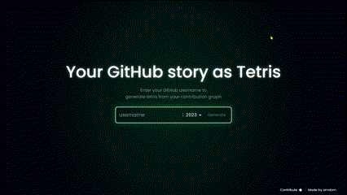

<p align="center">
  
</p>

# About GitHub Contribution Tetris 🌟
GitHub Contribution Tetris is a site where you enter your GitHub username, select a year of activity, and then get a playable generated Tetris game from that activity. It was built with Next.js and TS, while also taking bits and pieces from npm packages:

- [GitHub Contributions Canvas](https://github.com/sallar/github-contributions-canvas)
- [React-tetris](https://github.com/brandly/react-tetris)

# Developing locally

```bash
# install dependencies
yarn

# run locally
yarn dev
```

# Developing using codespaces
> Navigate to the repo link: https://github.com/arndom/github-contribution-tetris and click `<>Code` then select codespaces and click `+` to create a codespace with the already provided dev-container

Leave a 🌟 if you found this interesting.

